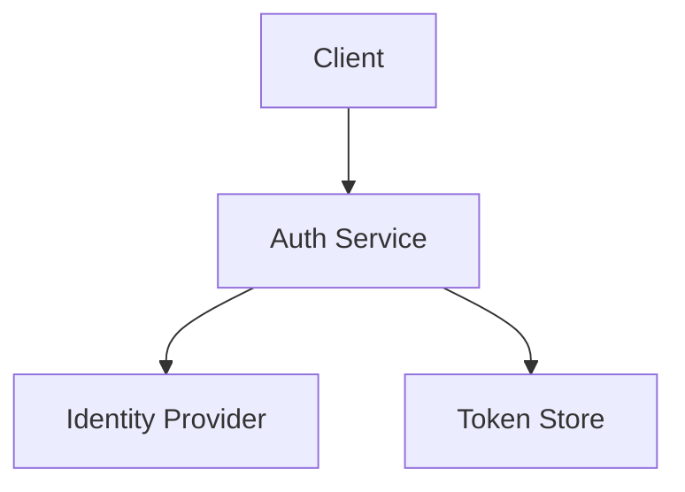

<!-- file: docs/modules/auth/README.md -->
<!-- version: 1.1.0 -->
<!-- guid: b5f5a228-e0df-4877-9bbf-443fd22c2917 -->

# Auth Module

## Module Overview

The Auth module provides authentication and authorization capabilities across
gcommon services.

### Purpose and Key Features

- Multi-factor authentication
- OAuth2 and OIDC support
- Role-based access control
- JWT token issuance and verification
- Pluggable identity providers
- Auditable login flows
- Session management
- API key management
- Dynamic permission evaluation
- Context-aware authorization

### Architecture Overview

The module is organized into layers:

1. `authpb` protocols define service contracts.
2. Services implement business logic using gcommon conventions.
3. Middleware integrates with web and gRPC stacks.
4. Storage providers persist user and session data.

The following diagram illustrates the high-level flow:



### Dependencies and Relationships

- Requires the Config module for secret management.
- Integrates with Metrics for login counters and histograms.
- Emits events consumed by the Notification module.

### Getting Started Guide

1. Enable the module in configuration:
   ```yaml
   auth:
     enabled: true
     provider: internal
   ```
2. Initialize service in your application:
   ```go
   svc := auth.NewService(cfg, logger)
   ```
3. Register routes with the Web module:
   ```go
   auth.RegisterHTTPRoutes(router, svc)
   ```
4. Use gRPC client for remote authentication:
   ```go
   client := authpb.NewAuthServiceClient(conn)
   resp, err := client.Login(ctx, req)
   ```

## API Reference

### Interfaces

```go
type Service interface {
    Login(ctx context.Context, req *LoginRequest) (*LoginResponse, error)
    Logout(ctx context.Context, req *LogoutRequest) (*LogoutResponse, error)
    Validate(ctx context.Context, token string) (*Claims, error)
}
```

### Method Descriptions

- **Login** authenticates a user and returns JWT credentials.
- **Logout** invalidates active sessions.
- **Validate** parses and verifies a token.

#### Example: Login

```go
resp, err := svc.Login(ctx, &auth.LoginRequest{
    Username: "alice",
    Password: "s3cret",
})
if err != nil {
    log.Fatal(err)
}
fmt.Println(resp.Token)
```

### Configuration Options

| Option        | Description                  | Default    |
| ------------- | ---------------------------- | ---------- |
| `provider`    | Identity provider backend    | `internal` |
| `token_ttl`   | Expiration for issued tokens | `15m`      |
| `refresh_ttl` | Refresh token lifetime       | `720h`     |

### Error Handling

All methods return `error`. Common errors include:

- `ErrInvalidCredentials` when user/password mismatch.
- `ErrTokenExpired` for expired tokens.
- `ErrUnauthorized` for unauthorized access. Check errors using `errors.Is`.

## Usage Guides

### Common Use Cases

- Authenticating API clients with JWT.
- Integrating with SSO providers.
- Protecting gRPC endpoints with middleware.
- Generating API keys for service-to-service communication.

### Best Practices

- Always hash and salt stored passwords.
- Rotate signing keys regularly.
- Use HTTPS to protect credentials.
- Limit login attempts to deter brute-force attacks.

### Performance Considerations

- Cache validated tokens to avoid repeated signature checks.
- Reuse gRPC client connections.
- Benchmark auth flows with realistic workloads.

### Production Deployment

- Store signing keys in a secure vault.
- Configure redundant identity providers.
- Enable structured logging for audit trails.
- Monitor metrics for login failures and latency.

## Examples

### Basic Usage

```go
svc := auth.NewService(cfg, logger)
token, err := svc.IssueToken(ctx, userID)
```

### Advanced Configuration

```yaml
auth:
  enabled: true
  provider: oidc
  oidc:
    issuer: https://accounts.example.com
    client_id: app
    client_secret: secret
```

### Integration Example

Combine with the Web module:

```go
router := mux.NewRouter()
auth.RegisterHTTPRoutes(router, svc)
web.ListenAndServe(router)
```

### Troubleshooting

- Ensure system clock is synchronized.
- Verify OIDC issuer URL and credentials.
- Check logs for `ErrInvalidCredentials` patterns.

## Further Reading

- [OAuth 2.0 RFC 6749](https://datatracker.ietf.org/doc/html/rfc6749)
- [OpenID Connect Core](https://openid.net/specs/openid-connect-core-1_0.html)
- [JWT RFC 7519](https://datatracker.ietf.org/doc/html/rfc7519)
